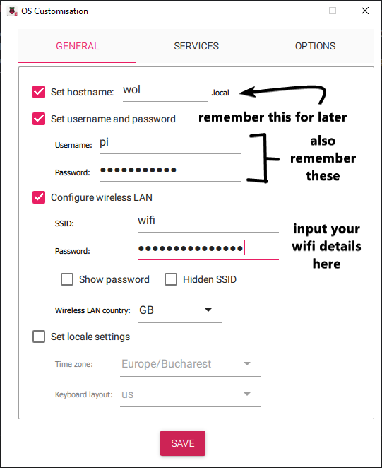
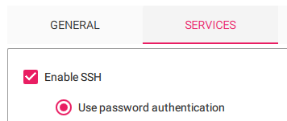
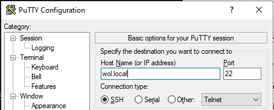

# How to put this thing on a Raspberry Pi
## Step 1: Flash the SD card
To flash the SD card, you're gonna need [Raspberry Pi Imager](https://www.raspberrypi.com/software/).

Once installed, select your model of RPI, select the latest Raspberry Pi OS Lite, 32 bit or 64 bit depending on your RPI.
Select your media, then presh CTRL/Command + Shift + X: This will bring up the settings panel:



Next, head to the settings panel and enable SSH by password.



Then, close the settings panel and flash the SD card.

## Step 2: SSH and Static IP address

On Windows, use [PuTTY](https://www.chiark.greenend.org.uk/~sgtatham/putty/latest.html). On Linux/MacOS, use the `ssh` command.

On Windows, open up putty and put in the hostname that you wrote in the first step:


On Linux, open up your terminal and write `ssh user@hostname.local` with user being the username that you set in step 1, and hostname being the hostname that you set in step 1.

Once you connected to the RPI, we want to set a static IP:

```
nmcli con
```
Once you've run this command, you will get something like this:
```
NAME           UUID                                  TYPE      DEVICE
preconfigured  60e4dc12-8424-46f6-9ee1-05a80b3373e4  wifi      wlan0
lo             0a3d8056-0e36-4c85-a22a-37f83e21767b  loopback  lo
```
We are interested in the UUID for the TYPE of wifi/ethernet. For me it is the UUID for the device name `preconfigured` which is `60e4dc12-8424-46f6-9ee1-05a80b3373e4`. <br>
Copy this UUID, since we will need it a lot later. I will be referring to this ID as `UUID`.

Next, we need to run these commands:
```
sudo nmcli con modify UUID ipv4.addresses 192.168.1.XX/24 # Change this to the IP address you want to assign the RPI.

sudo nmcli con modify UUID ipv4.gateway 192.168.1.1 # Most commonly 192.168.1.1

sudo nmcli con modify UUID ipv4.dns "1.1.1.1" # Cloudflare DNS

sudo nmcli con modify UUID ipv4.method manual

sudo nmcli connection down UUID && sudo nmcli connection up UUID # RUN THIS IN ONE COMMAND!
```

Now, reboot your RPI and you should have a static IP address. To check, run ``ip a``.

## Step 3: Install NodeJS

Run these commands:
```
curl -fsSL https://deb.nodesource.com/gpgkey/nodesource-repo.gpg.key | sudo gpg --dearmor -o /usr/share/keyrings/nodesource.gpg

NODE_MAJOR=18

echo "deb [signed-by=/usr/share/keyrings/nodesource.gpg] https://deb.nodesource.com/node_$NODE_MAJOR.x nodistro main" | sudo tee /etc/apt/sources.list.d/nodesource.list

sudo apt update
```

This will install the NodeJS repository in your apt configuration and refresh the apt repositories.

Next, you can install NodeJS by simply running `sudo apt install nodejs`.

## Step 4: WOL Server

To install WOL Server on the RPI, we need to install git first.

```
sudo apt install git
```
Then, clone the repository:

```
git clone https://github.com/slashedCodes/wol-server.git
cd wol-server
```

Once you're done cloning the repository, install the dependencies:
```
npm i # Install dependencies
sudo npm i -g nodemon # Install nodemon
```

Now we need to rename the config file and edit it to fit your needs:

```
mv config.json5.example config.json5
nano config.json5 
```

To check if the project works, run either of these commands:

```
# Run using package.json scripts
npm run start

# Run manually using nodemon
nodemon index.js
```

## Step 5: Systemd

Lets say you want the server to start when you start the RPI, in case of a power loss for example. In this case, we need to create a service for systemd:

```
sudo nano /etc/systemd/system/wol-server.service
```

This will open nano on a new file called `wol-server.service`. For systemd to register this service we need to add some info:

```
[Unit]
Description=Wake-On-Lan Server

[Service]
User=YOUR USER HERE
WorkingDirectory=/home/YOUR USER HERE/wol-server/
ExecStart=npm run start
Restart=always
RestartSec=3

[Install]
WantedBy=multi-user.target
```

Then, press CTRL + X to save and close the file. <br>
Next, we need to refresh Systemd:

```
sudo systemctl daemon-reload
sudo systemctl enable wol-server
sudo systemctl start wol-server
sudo systemctl status wol-server # Check if it's working.
```

And you should be done.